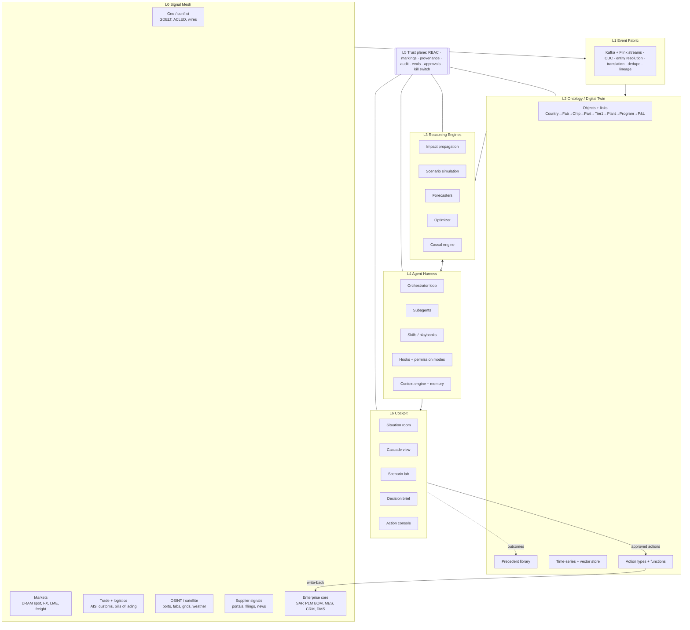

# COCKPIT — a Decision OS for the people who run billion-dollar companies

> A Foundry/AIP-class platform rebuilt around one promise: **an event happens anywhere in the world, and within 60 seconds the MD sees what it means for *their* P&L, what the options are, what each costs, and can approve one with a tap.**

This document is the target architecture. It borrows the two best-proven ideas available today:

1. **Palantir's Ontology** — model the business (and the world it depends on) as typed *objects*, *links* and *actions*, so data, logic and decisions share one vocabulary.
2. **The Claude Code agent harness** — a tool-calling agent loop with subagents, skills, hooks, permission modes and context management, so LLM reasoning is *bounded, auditable and composable* instead of a chatbot guessing.

The combination is the point: the Ontology gives agents something true to reason over; the harness gives the Ontology a mind that can work through a novel situation step by step.

---

## 1. Design principles

| # | Principle | Consequence |
|---|-----------|-------------|
| 1 | **The model never invents numbers.** | Every quantity in a brief comes from a reasoning engine (L3) or the ontology (L2), with a provenance link. The LLM plans, routes, explains — it does not compute exposure. |
| 2 | **Outside-in AND inside-out.** | The twin covers the enterprise (BOM, plants, contracts) *and* the external world it depends on (fabs, ports, countries, commodities). Without the external half you can't see Taiwan → MCU → Nexon. |
| 3 | **N-tier, not Tier-1.** | Most shocks hit Tier-2..N. The graph must resolve down to fab/wafer level, or the system is blind exactly where it matters. |
| 4 | **Decisions, not dashboards.** | The output unit is a *Decision Brief*: options, cost, time-to-impact, confidence, dissent, and a one-tap action. Charts are evidence, not the product. |
| 5 | **Adversarial by default.** | A Red Team subagent attacks every recommendation before the MD sees it. Its dissent is shown, not hidden. |
| 6 | **Act through governed verbs only.** | Agents can only change the world via typed Action Types with permissions, approval gates and audit — never raw writes. |
| 7 | **Every decision is a training example.** | Outcomes are logged against predictions; the system calibrates itself over time. |

---

## 2. Layer map



---

## 3. Layer by layer

### L0 — Signal Mesh

Two halves, both mandatory.

**Outside-in (the world):**

| Feed class | Examples | Why |
|---|---|---|
| Geopolitics / conflict | GDELT, ACLED, Reuters/AP/Bloomberg wires, government gazettes, sanctions lists (OFAC, EU, MEA) | First trigger signal |
| Markets | DRAM/NAND spot (TrendForce/DRAMeXchange), LME metals, FX, Brent, container + air freight indices, war-risk premiums | Price shock + early warning (markets move before news) |
| Trade + logistics | AIS vessel positions, port congestion, customs/bill-of-lading data (Panjiva/ImportGenius-class), flight cargo | Confirms physical disruption; maps hidden supplier links |
| OSINT / earth observation | Satellite imagery (Planet/Maxar-class), night lights, grid outages, weather/quakes (USGS) | Fab/port status when official info lags |
| Supplier intelligence | Supplier portals, filings, earnings calls, credit risk, N-tier mapping vendors | Fills Tier-2..N gaps |

**Inside-out (the company):** ERP (SAP S/4: POs, inventory, contracts), PLM (full BOM with part→manufacturer→fab where known), MES (line rates), CRM/dealer DMS (order book by trim), treasury (hedges), program management (SDV milestones).

### L1 — Event Fabric

- **Streaming backbone:** Kafka topics per feed; Flink jobs for normalisation, windowing, anomaly scoring.
- **CDC** from ERP/PLM so the twin is minutes-fresh, not nightly.
- **Entity resolution** is the hardest, most valuable part: "TSMC", "台積電", "Taiwan Semiconductor Mfg Co Ltd", and a customs consignee code must collapse to one `Fab` object. Use deterministic keys (LEI, DUNS, GLN) + learned matchers + human review queue.
- **Event objects:** every signal becomes a typed `Event {type, geo, actors, confidence, sources[]}` with lineage back to raw docs.

### L2 — Ontology (the digital twin)

Semantic layer (nouns):

```
Country ─hosts→ Fab ─produces→ ChipSKU ─used_in→ Module/Part ─supplied_by→ Tier1Supplier
Tier1Supplier ─ships_to→ Plant ─builds→ VehicleProgram ─sells_as→ Trim ─generates→ Revenue
Port/Lane ─carries→ Shipment ─contains→ Part
Contract ─binds→ (Supplier, Part, volume, price, force-majeure terms)
Commodity ─input_to→ ChipSKU / Part
Event ─affects→ any of the above (with probability + severity)
```

Kinetic layer (verbs), each a governed **Action Type** with parameters, validations, approval policy and write-back connector:

`raise_buffer_po`, `request_allocation`, `qualify_alternate_source`, `reallocate_supply`, `adjust_build_plan`, `place_fx_or_commodity_hedge`, `change_trim_content`, `open_war_room`, `notify_supplier`.

**Functions** (versioned, tested code) compute derived properties: `exposure(event, program)`, `days_of_cover(part)`, `margin_at_risk(program, horizon)`, `substitutability(part)`.

**Precedent library:** curated past shocks (2011 Tohoku/Renesas fire, 2021 chip crisis, 2021 Suez blockage, 2022 Shanghai lockdown, 2024 Red Sea) with measured lead-time and price curves — used to calibrate simulations and give the MD analogies ("this looks like Renesas 2021 × 5").

### L3 — Reasoning Engines

These are deterministic or statistical services exposed as tools. Agents call them; they do not replace them.

| Engine | Method | Output |
|---|---|---|
| **Impact propagation** | Probabilistic graph traversal over the ontology; edge weights = share of supply, substitutability, inventory buffer, lead time | Exposure score per node, with the path that explains it |
| **Scenario simulation** | Monte Carlo + system dynamics (inventory, lead-time, price elasticity); scenarios parameterised (blockade 2 wk / 3 mo / 12 mo) | Fan charts of units lost, revenue, margin over time |
| **Forecasters** | Gradient-boosted + time-series foundation models for spot price, lead time, demand | Distributions, not point estimates |
| **Optimizer** | MILP / CP-SAT for allocation of scarce parts across plants/programs/trims, buy-ahead sizing | Plans with shadow prices ("one more MCU is worth ₹X") |
| **Causal engine** | Structural causal models / counterfactuals over precedents | "What if we had bought 3 months earlier?" — used for evaluation & learning |

### L4 — Agent Harness (the Claude Code pattern)

This is where the Claude Code architecture maps almost 1:1:

| Claude Code concept | Cockpit equivalent |
|---|---|
| Agent loop (plan → tool → observe → repeat) | **Orchestrator** working an Event until it can produce a Decision Brief |
| Tools (Read, Grep, Bash, Edit…) | `ontology.query`, `ontology.traverse`, `sim.run`, `forecast.get`, `optimize.solve`, `web.search`, `action.propose` |
| MCP servers | Connectors to SAP, Bloomberg, supplier portals, email/Slack — all surfaced as namespaced tools |
| Subagents (isolated context, scoped tools, summary return) | **Geo Analyst**, **Supply Tracer**, **CFO Modeler**, **Ops Planner**, **Red Team**, **Brief Writer** — run in parallel, each returns a compact structured report |
| Skills (reusable instructions loaded on demand) | **Playbooks**: `chip-shock`, `fx-shock`, `sanctions`, `port-closure`, `key-supplier-insolvency` — encode the firm's own crisis doctrine |
| CLAUDE.md / memory | **Company memory**: strategy, risk appetite, red lines ("never single-source safety ECUs"), MD's preferences, past decisions |
| Context compaction | Long-running war rooms summarise older turns while keeping the ontology state as ground truth |
| Hooks (PreToolUse / PostToolUse) | **Policy hooks**: block an action that breaches a covenant, require CFO co-sign above ₹X Cr, auto-attach provenance, log everything |
| Permission modes (plan / default / auto) | **Observe** (read only) → **Recommend** (draft actions) → **Act-with-approval** (one-tap) → **Autonomous within limits** (e.g. auto-reorder under ₹5 Cr) |
| Plan mode | **Scenario sandbox**: agents explore on a branched copy of the twin; nothing touches production until approved |
| Auto-mode safety classifier | A separate model screens each proposed action for scope creep, prompt injection from external feeds, and policy breach |

**Why subagents matter here:** a geopolitical event produces megabytes of noisy signal. Putting it all in one context window degrades reasoning. Each subagent burns its own context on its slice and hands back ~1 page; the orchestrator reasons over six clean pages.

**Prompt-injection stance:** every external feed is *data, never instructions*. Signals enter agent context only via typed Event objects and quoted excerpts, never raw HTML.

### L5 — Trust Plane (cross-cutting)

- **RBAC + markings + purpose-based access:** the plant manager sees their plant; the MD sees everything; JV partner data is marked and compartmentalised.
- **Provenance per claim:** every sentence in a brief links to the objects, engine runs and sources behind it. Click "₹2,400 Cr at risk" → see the traversal path and simulation run ID.
- **Immutable audit log** of every agent step, tool call, human approval and override.
- **Evals + calibration:** replay historical shocks (2021 chip crisis) as tests; track Brier scores of probability claims; regression-test agent behaviour on every model or prompt change.
- **Global branching:** scenarios run on branches of the ontology (like git for the twin).
- **Kill switch:** one control drops all agents to Observe.

### L6 — The Cockpit (UX)

One screen, five panes, dark "ops room" aesthetic:

1. **Situation Room** — world map; live events pulsing; company exposure overlaid as heat (fabs, ports, plants, suppliers).
2. **Cascade View** — the graph from event to P&L, edges weighted by exposure; click any node to drill down.
3. **Scenario Lab** — sliders (blockade length, buffer size, spot price) → fan charts update in seconds.
4. **Decision Brief** — the hero pane: headline, 3–4 options with cost / time-to-impact / confidence / reversibility, the Red Team's dissent, recommended choice.
5. **Action Console** — approve → typed actions fire into SAP / supplier email / treasury, with approval chain and audit.

Plus: natural-language bar ("what if it lasts 6 months?"), war-room mode (shared live session for CXOs), mobile brief push for the MD.

---

## 4. Worked run: Taiwan Strait blockade → Tata Motors

> Exposure figures below are illustrative of the *shape* of the analysis, not real Tata Motors data.

| Clock | What happens | Layer |
|---|---|---|
| T+0s | Wire reports + AIS shows strait traffic collapsing + war-risk premium jumps → fused into one `Event(BLOCKADE, Taiwan, conf 0.92)` | L0 → L1 |
| T+3s | Entity resolution links event to ontology: TSMC, UMC, VIS, Nanya, ASE fabs; Kaohsiung/Keelung ports | L1 → L2 |
| T+8s | Impact propagation walks N-tier BOM: MCUs + cockpit SoCs → infotainment/ADAS/BMS modules → Harman/Bosch/Continental/Visteon → Nexon/Punch/Harrier EV, SDV zonal compute, JLR premium trims | L3 |
| T+8s | **Hidden link surfaced:** Tata's own Dholera fab's technology partner (PSMC) is Taiwanese → India-fab-as-hedge is itself exposed | L2/L3 |
| T+20s | 10k Monte Carlo runs × 3 blockade durations; DRAM already tight from AI demand → second price spike; cloud/OTA cost rises | L3 |
| T+40s | Optimizer sizes buy-ahead + reallocation; Red Team argues "buying now at panic prices locks in loss if blockade ends in 2 weeks" → quantified | L3/L4 |
| T+60s | Brief on MD's screen | L6 |

**The brief the MD reads:**

- **A — Buy now (recommended):** lock 6–9 months of auto-grade MCU + DRAM before spot spikes. Cost: ₹X Cr working capital. Protects ~Y% of H2 volume. Reversible: partially (resale market).
- **B — Dual-source:** fast-track qualification of non-Taiwan fabs (Samsung, GlobalFoundries, Infineon/NXP own fabs). 6–12 months; reduces structural exposure.
- **C — De-content:** ship base screens now, unlock premium features via OTA once supply returns. Protects volume, hurts mix.
- **D — Reallocate:** optimizer routes scarce chips to highest-margin programs (JLR, EV) first.
- **Red Team dissent:** shown in full, with the probability band where A is the wrong call.
- **Second-order flag:** SDV program timeline at risk; recommend board-level review of compute-platform sourcing.

---

## 5. Reference tech stack

| Concern | Choice (swappable) |
|---|---|
| Streaming | Kafka (Confluent/Redpanda) + Flink |
| Lakehouse | Iceberg on object storage; Spark / DuckDB / Polars compute |
| Ontology store | Property graph (Neo4j / TigerGraph / Neptune) + Postgres for object metadata; OpenSearch for search; pgvector/Qdrant for embeddings |
| Time-series | ClickHouse or TimescaleDB |
| Engines | Python services: NetworkX/graph-tool → GPU (cuGraph) at scale; OR-Tools / Gurobi; PyMC / NumPyro; Darts / time-series FMs |
| Agent harness | Claude Agent SDK (same loop, tools, subagents, hooks, MCP as Claude Code) on the latest Claude models; Temporal for durable long-running workflows |
| Connectors | MCP servers per system (SAP, Bloomberg, Slack, email, supplier portals) |
| Frontend | Next.js + deck.gl/MapLibre (map) + Sigma.js/Cytoscape (graph) + Observable Plot (fan charts); WebSocket live updates |
| Security | OPA/Cedar for policy; Keycloak/Okta; per-tenant KMS; VPC-isolated LLM endpoints with no retention |
| Ops | Kubernetes, ArgoCD, OpenTelemetry tracing end-to-end (signal → brief) |

### Latency budget for the 60-second promise

| Stage | Budget | How |
|---|---|---|
| Ingest + fuse | 2–5 s | Streaming, pre-subscribed feeds |
| Resolve to ontology | 1–3 s | Pre-indexed entity graph |
| Traverse + score | 2–5 s | Pre-computed exposure paths, incremental updates |
| Simulate | 10–20 s | Pre-warmed models, GPU Monte Carlo, scenario templates per playbook |
| Agents (parallel subagents) | 15–25 s | Parallel fan-out; deterministic engines do the heavy math |
| Render brief | 1–2 s | Streamed UI |

The trick is **pre-computation**: exposure paths for the top ~200 geopolitical scenarios are kept warm continuously, so a real event becomes a lookup + refinement, not a cold start.

---

## 6. Build roadmap

| Phase | Scope | Proves |
|---|---|---|
| **0 — Spine (6–8 wks)** | Ontology schema; ingest BOM + suppliers + 3 external feeds; static impact propagation; CLI agent over the ontology | Can we trace an event to a program? |
| **1 — One playbook end-to-end (8–10 wks)** | `chip-shock` playbook; simulation + optimizer; Decision Brief UI; Red Team; provenance links | 60-second brief for one scenario class |
| **2 — Cockpit (10–12 wks)** | Situation room, cascade view, scenario lab; Observe/Recommend modes; audit + evals harness replaying 2021 crisis | MD-usable product |
| **3 — Act (ongoing)** | Write-back Action Types to SAP/treasury, approval chains, Act-with-approval mode | Closes the loop |
| **4 — Learn** | Outcome tracking, calibration dashboards, playbook library growth, more industries | Compounding advantage |

---

## 7. What makes this more than a scraper with charts

- **The ontology is the moat.** Feeds are commodities; a resolved N-tier graph linking a Taiwanese fab to a specific Tata trim's margin is not.
- **Agents are bounded workers, not oracles.** They orchestrate deterministic engines, under policy hooks and permission modes, with every claim traceable.
- **The output is a decision with a button**, adversarially tested, and every decision makes the next one better.

---

### Sources consulted

- Palantir docs: [Ontology overview](https://www.palantir.com/docs/foundry/ontology/overview/), [Ontology architecture](https://www.palantir.com/docs/foundry/object-backend/overview/), [AIP architecture](https://www.palantir.com/docs/foundry/architecture-center/aip-architecture/), [Vertex scenarios](https://www.palantir.com/docs/foundry/vertex/scenarios-overview/), [Action types](https://www.palantir.com/docs/foundry/action-types/overview/)
- Claude Code public docs and write-ups on the agent loop, tools, subagents, skills, hooks, permission modes and MCP (e.g. [How Claude Code works](https://code.claude.com/docs/en/how-claude-code-works), [Subagents](https://docs.anthropic.com/en/docs/claude-code/sub-agents), [Hooks](https://code.claude.com/docs/en/hooks))
- 2026 semiconductor context: [GlobX — Semiconductor shortage 2026](https://globx.eu/blog/supply-chain-insight/semiconductor-shortage-2026-european-oems) (WSTS memory surge, mature-node pressure, Taiwan concentration)
