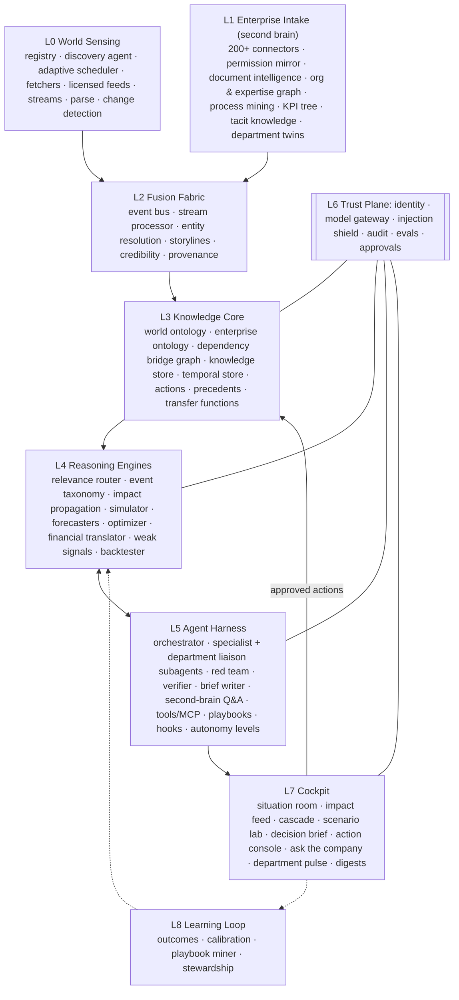

# COCKPIT: a Decision OS for people who run large companies

> Something happens anywhere in the world, or anywhere inside the company. Within about a minute, the right leader sees what it means for *their* P&L and *their* departments, the options, what each costs, how sure we are, and the strongest argument against the recommendation. They can approve an action with one tap.

COCKPIT is domain-agnostic. A war, a central-bank surprise, a new regulation, a competitor's price cut, a heatwave, a ransomware attack on a supplier, or a scrap spike on one assembly line all travel the **same path** through the same blocks. Only the event type, the edges traversed and the playbook change.

- **Interactive atlas** (every block, clickable, with how it works): [`docs/atlas/index.html`](atlas/index.html)
- **Full block catalog** (generated from the same data): [`docs/BLOCKS.md`](BLOCKS.md)
- **Source of truth:** [`docs/atlas/blocks.json`](atlas/blocks.json). Rebuild with `node scripts/build-atlas.mjs`.

It combines two proven ideas:

1. **Palantir's Ontology**: model the business and the world it depends on as typed objects, links and governed actions, so data, logic and decisions share one vocabulary.
2. **The Claude Code agent harness**: a tool-calling loop with subagents, skills, hooks, permission modes and context management. This keeps LLM reasoning bounded, auditable and composable.

---

## 1. Principles

| # | Principle | What it forces in the design |
|---|-----------|------------------------------|
| 1 | **Models never invent numbers** | Every figure comes from a deterministic engine or a governed metric, with a run ID or citation. Agents plan, route and explain. |
| 2 | **General by construction** | Generality comes from an event-type taxonomy (about 300 types in 15 families) and a typed dependency graph, not from per-domain code. |
| 3 | **Outside-in and inside-out** | The twin covers the world (countries, regulators, markets, infrastructure, competitors) *and* the enterprise (every department, process, document, KPI). |
| 4 | **The whole company is the knowledge base** | Thousands of departments are generated from HR, directory and system data, not drawn by hand. Each gets a Department Twin and an on-demand liaison agent. |
| 5 | **Permission-true** | The AI never shows anyone something they could not open in the source system. ACLs are mirrored and enforced before retrieval. |
| 6 | **Decisions, not dashboards** | The unit of output is a Decision Brief with options, ranges, confidence, dissent and an action button. |
| 7 | **Adversarial and verified** | A Red Team attacks every escalated recommendation. A Verifier checks every number and claim against provenance. |
| 8 | **Act only through governed verbs** | Real-world changes happen only through typed Action Types, behind policy hooks, autonomy levels and human approval. |
| 9 | **Learns from outcomes** | Every prediction is scored against what happened, and sources, transfer functions, thresholds and playbooks recalibrate. |

---

## 2. Layer map

---

## 3. How world sensing runs on its own (L0)

There are no manual searches. The loop runs continuously:

1. **Source Registry**: 40k–80k sources, each with access method, coverage (which ontology objects it reports on), reliability prior, typical lead time, cost and legal basis.
2. **Source Discovery Agent**: finds coverage gaps (for example, a key supplier covered by only one source), hunts for primary and local-language sources, and **backtests** each candidate against past events before proposing it. Humans approve paid sources.
3. **Adaptive Crawl Scheduler**:
   - Learns each source's change rate and sets priority as change rate × importance × exposure.
   - Respects robots.txt and rate limits, and uses conditional GETs.
   - **Surge mode**: when a storyline forms, every related source is polled far more often for a set window.
4. **Fetcher Fleet**: plain HTTP for most pages, headless Chromium for JS-heavy sites, plus document, audio and video fetchers. Every raw response is archived (WARC + hash), so any fact traces to the exact bytes. No CAPTCHA solving and no login bypass.
5. **Licensed feeds and streams** are used first wherever they exist: wires, market data, AIS/ADS-B, satellite, weather, regulators, sanctions lists, filings, threat intel. They arrive over push connections in under a second.
6. **Parse & Extract**: boilerplate removal, layout-aware PDF and OCR, speech-to-text with speakers, translation that keeps the original.
7. **Change Detector**: diffs living documents (laws, tariffs, competitor price pages, supplier terms) and labels which changes actually matter.

About 1M documents a day collapse into roughly 20k storylines a day (L2). Of those, around 50 reach the CXO and a few hundred reach department owners (L4 Relevance Router).

---

## 4. The second brain (L1 + L3)

- **Connector Mesh** covers ERP, CRM, HR, procurement, treasury, contracts, PLM, MES/SCADA, quality, maintenance, SharePoint/Drive/Confluence/Jira, Teams/Slack, opt-in email, meeting transcripts, warehouses and BI. It runs inside the company perimeter.
- **Permission Mirror** copies every source system's ACLs onto every chunk and object. It fails closed, and compartments (M&A, legal privilege, HR, board) need explicit grants.
- **Document Intelligence**:
  - Chunks along each document's structure and links entities to the ontology.
  - Classifies department, sub-department, document type, process and sensitivity.
  - Judges whether a document is current or superseded.
  - Writes 3-level summaries and embeddings.
- **Org & Expertise Graph**: company → BU → department → sub-department → team → role → person, built from data, plus who actually knows what. Every ontology object gets an owner, so alerts route to people.
- **Process Mining** shows how work really flows, so impacts can propagate through processes.
- **KPI Tree** keeps one definition per metric, from EBITDA down to a single machine. It turns any operational change into money and an accountable owner.
- **Tacit Knowledge Capture** extracts decisions and rationale from meetings and interviews experts before knowledge leaves. Nothing is published without the expert's approval.
- **Department Twins** are auto-maintained profiles of every department. Each grounds a **Department Liaison agent** that speaks for that department when an event touches it.
- **Second Brain Q&A** lets any employee ask anything and get a cited, permission-scoped answer, plus the name of the expert to ask when the documents run out.

---

## 5. What makes it general (L3 + L4)

- **Dependency Bridge Graph**: typed, weighted edges between the enterprise and the world. Edge types: `supplies`, `sells_in`, `regulated_by`, `priced_in`, `financed_by`, `competes_with`, `depends_on_infra`, `employs_in`, `reputational_exposure`. A coverage score per BU shows the blind spots.
- **Event-Type Taxonomy**: each of about 300 types names its propagation channels, transfer functions, specialist agents, departments and playbook.
- **Transfer Function Library**: quantified, lagged, uncertain responses per edge × event type, estimated from history and backtested.
- **Impact Propagation Engine**: Monte Carlo traversal along the prescribed channels, net of buffers, returning ranked, explained paths. Paths for the top 200 standing scenarios are kept precomputed.
- **Simulator, Forecasters, Optimizer, Financial Translator**: turn paths into scenarios, then into options, then into P&L, cash and covenants by BU and quarter.

---

## 6. Agent harness (L5): the Claude Code pattern

| Claude Code | COCKPIT |
|---|---|
| Agent loop | **Orchestrator** owns a situation from escalation to brief, as a durable workflow |
| Subagents with isolated context and scoped tools | Geopolitics, Markets, Ops, Finance, Customer, Legal analysts, plus **Department Liaisons** (one per affected department) |
| Tools + MCP | `ontology.*`, `knowledge.search`, `metrics.query`, `sim.run`, `forecast.get`, `optimize.solve`, `fin.translate`, `action.propose`, and MCP servers for every external system |
| Skills | **Playbooks** per event family and company doctrine, loaded on demand |
| CLAUDE.md / memory | **Company memory**: strategy, risk appetite, red lines, the MD's preferences |
| Context compaction | Long war rooms are compacted, with the ontology as ground truth |
| Hooks | **Policy engine** on every tool call and action: delegation of authority, spend limits, covenants, sanctions screening, residency |
| Permission modes | **Autonomy levels**: Observe → Recommend → Act-with-approval → Bounded autonomy, earned by track record |
| Auto-mode safety classifier | **Injection shield** + action safety model |

There are also three checking agents. The **Red Team** argues against the recommendation, and its dissent is shown in full. The **Verifier** checks every number and claim against provenance and the reader's permissions. The **Brief Writer** cannot introduce numbers.

---

## 7. The 60-second budget

| Stage | Budget |
|---|---|
| Signal arrives and fuses into a storyline | 2–5 s |
| Credibility + relevance routing | 1–2 s |
| Impact propagation (warm paths) | 2–8 s |
| Simulation | 5–20 s |
| Parallel subagents + red team + verifier | 15–25 s |
| Brief rendered | 1–2 s |

---

## 8. Traced scenarios (step-by-step in the atlas)

1. **Taiwan Strait blockade** (geopolitical): auto OEM MD
2. **Surprise 50 bp rate hike** (monetary): CFO / MD
3. **New EU carbon-border rule** (regulation): compliance / MD
4. **Competitor price cut** (competitive): sales head / MD
5. **Heatwave + weak monsoon** (climate): COO / MD
6. **Ransomware at a key supplier** (cyber): CISO / COO
7. **Scrap spike on Line 3** (internal operations): plant head

---

## 9. Reference stack

Kafka/Redpanda + Flink · Iceberg lakehouse · Neo4j/TigerGraph-class property graph · OpenSearch/Vespa + vector index · ClickHouse · Playwright + Go/Rust fetchers on Kubernetes · Debezium/Kafka Connect/OPC-UA · dbt/MetricFlow semantic layer · cuGraph + JAX Monte Carlo · Gurobi/OR-Tools · PyMC · Claude Agent SDK on the latest Claude models · Temporal · OPA/Cedar · Okta/Entra · OpenTelemetry · Next.js + deck.gl + Sigma.js.

---

## 10. Roadmap

| Phase | Scope | Proves |
|---|---|---|
| 0 Spine | Ontology schema, 5 connectors, 10 licensed feeds, bridge graph for 1 BU, propagation, CLI orchestrator | An event can be traced to money |
| 1 Second brain | Permission mirror, document intelligence, org graph, Ask the Company | Trusted, permission-true internal knowledge |
| 2 Cockpit | Relevance router, 3 playbook families, simulator, optimizer, financial translator, Decision Brief, red team, verifier | 60-second brief for real events |
| 3 Scale sensing | Source registry + discovery agent, adaptive crawler, change detection, full taxonomy | Coverage across all event families |
| 4 Act | Action types with write-back, approvals, autonomy levels | Closed loop |
| 5 Learn | Outcome tracking, calibration, playbook miner, backtests gating releases | Gets better every month |

---

### Sources consulted

- Palantir: [Ontology overview](https://www.palantir.com/docs/foundry/ontology/overview/), [Ontology architecture](https://www.palantir.com/docs/foundry/object-backend/overview/), [AIP architecture](https://www.palantir.com/docs/foundry/architecture-center/aip-architecture/), [Vertex scenarios](https://www.palantir.com/docs/foundry/vertex/scenarios-overview/), [Action types](https://www.palantir.com/docs/foundry/action-types/overview/)
- Claude Code public docs: [How Claude Code works](https://code.claude.com/docs/en/how-claude-code-works), [Subagents](https://docs.anthropic.com/en/docs/claude-code/sub-agents), [Hooks](https://code.claude.com/docs/en/hooks)
